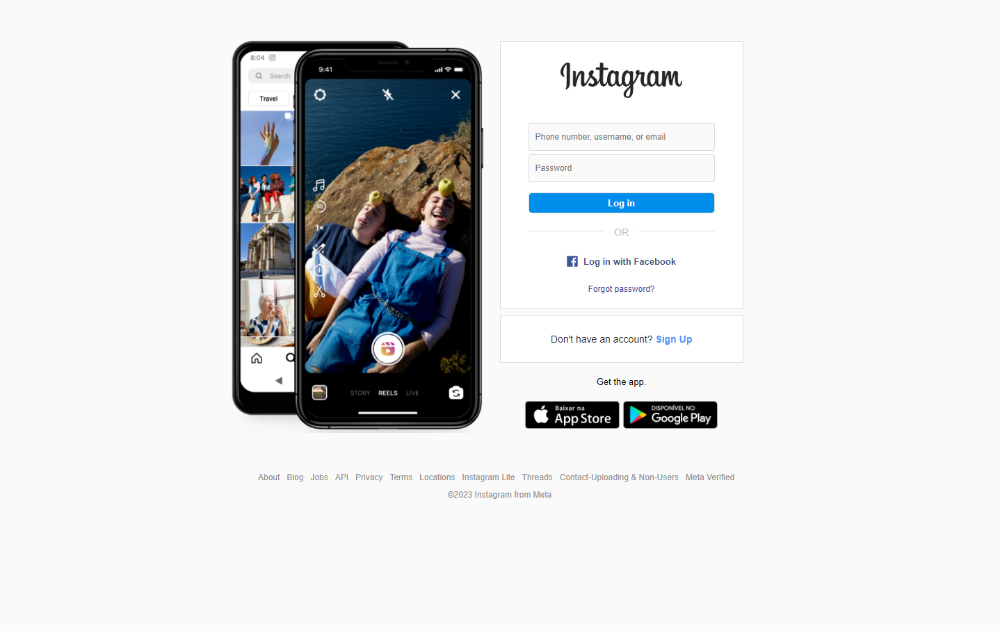
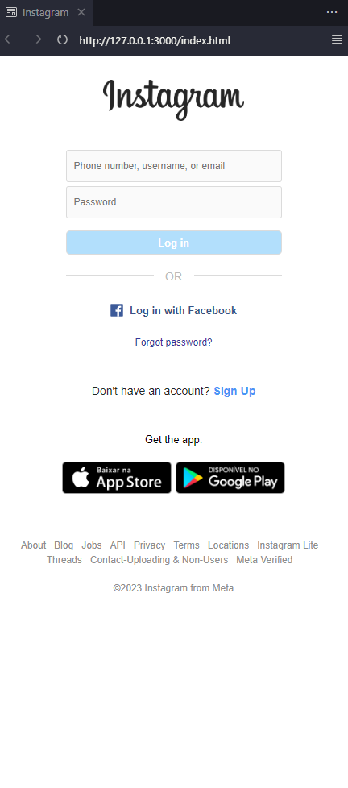

# Instagram
## Login Page

This project was undertaken with the goal of enhancing my skills in HTML and CSS. Inspired by the design of the Instagram login page, I aimed to replicate its visual elements as a learning challenge.

## Project Structure
- **index.html:** Contains the html.
- **styles.css:** Style file to enhance the visual presentation.
- **images folder** This directory contains all the images utilized in the project
  

# DESKTOP

 
# MOBILE

