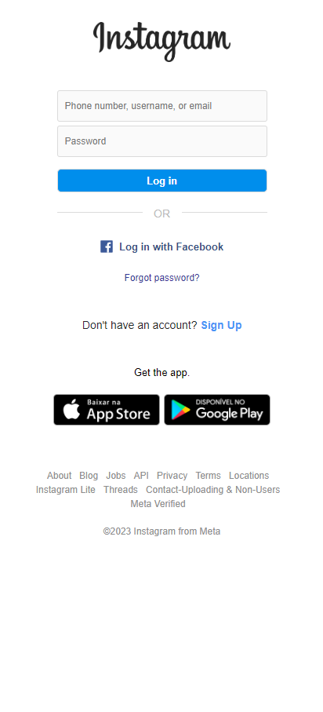

# Instagram
## Login Page

This project was undertaken with the goal of enhancing my skills in HTML and CSS. Inspired by the design of the Instagram login page, I aimed to replicate its visual elements as a learning challenge.

## Project Structure
- **index.html:** Contains the html structure .
- **styles.css:** Style file to enhance the visual presentation.
- **images folder** This directory contains all the images utilized in the project

## How to use:
1. Clone the repository: `git clone https://github.com/MiguelCapitao/Instagram-LoginPage.git`
2. Navigate to the project directory: `cd Instagram-LoginPager`
3. Open the `index.html` file in your browser.
  

# DESKTOP

 
# MOBILE

